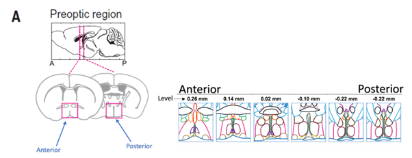

\newpage

```{r,include=FALSE}
library(knitr)
```


To hyperlink to figure one, use the following: \hyperref[dummy-one]{\color{blue}Fig. 1} 

To hyperlink to figure two, use the following: \hyperref[dummy-two]{\color{blue}Fig. 2} 

To hyperlink to figure three, use the following: \hyperref[dummy-three]{\color{blue}Fig. 3} 

To hyperlink to figure four, use the following: \hyperref[dummy-four]{\color{blue}Fig. 4} 

To hyperlink to figure five, use the following: \hyperref[dummy-five]{\color{blue}Fig. 5} 

To hyperlink to figure six, use the following: \hyperref[dummy-six]{\color{blue}Fig. 6} 


# Abstract


\newpage

# Body


\newpage

# Conclusion


\newpage


# Figures

```{r, results='asis', echo=FALSE}
# Dummy coding for the hyperlink
cat("\\phantomsection\\label{dummy-one}\n")
```
```{r fig-one,echo=FALSE,out.width='100%',fig.cap="CCK Plot"}
include_graphics("./plots/CCK.png")
```

```{r, results='asis', echo=FALSE}
# Dummy coding for the hyperlink
cat("\\phantomsection\\label{dummy-two}\n")
```
```{r fig-two,echo=FALSE,out.width='100%',fig.cap="Fig 2: CRH Plot"}
include_graphics("./plots/CRH.png")
```

```{r, results='asis', echo=FALSE}
# Dummy coding for the hyperlink
cat("\\phantomsection\\label{dummy-three}\n")
```
```{r fig-three,echo=FALSE,out.width='100%',fig.cap="VLPO Plot"}
include_graphics("./plots/VLPO.png")
```

```{r fig-four, results='asis', echo=FALSE}
# Dummy coding for the hyperlink
cat("\\phantomsection\\label{dummy-four}\n")
```
```{r,echo=FALSE,out.width='100%',fig.cap="MnPO Plot"}
include_graphics("./plots/MnPO.png")
```

```{r, results='asis', echo=FALSE}
# Dummy coding for the hyperlink
cat("\\phantomsection\\label{dummy-five}\n")
```
```{r fig-five,echo=FALSE,out.width='100%',fig.cap="Change the caption for this. Clusters Misael asked for."}
include_graphics("./plots/Misael.png")
```

```{r, results='asis', echo=FALSE}
# Dummy coding for the hyperlink
cat("\\phantomsection\\label{dummy-six}\n")
```
```{r fig-six,echo=FALSE,out.width='100%',fig.cap="Figure from the original"}

```


